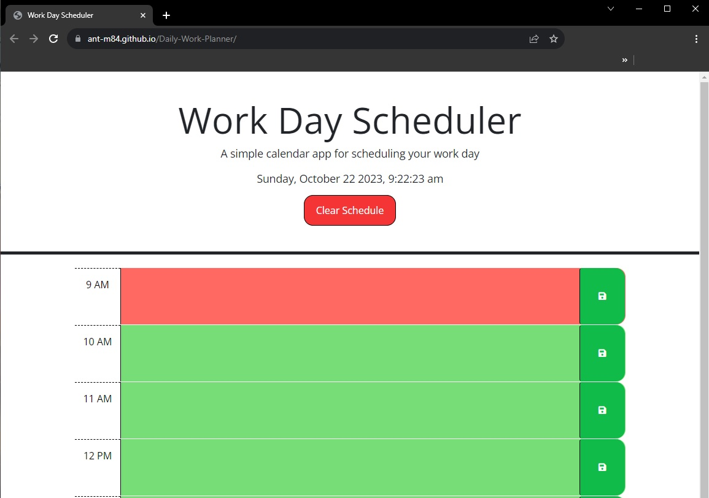

# Daily-Work-Planner

https://ant-m84.github.io/Daily-Work-Planner/

## Description

This application is a daily work planner that enables a user to schedule a standard '9 - 5' work day by the hour.

## Usage

A user may input data into each hourly section and save the data to local storage that will remain saved upon page refresh.

The current time of day will be reflected on the schedule with the current hour on the schedule showing an orange background, with past hours displaying a grey background and future hours displaying a green background.

The schedule can be cleared by clicking the 'Clear Schedule' button at the top of the page.

## Credits

This project was compiled using starter code (HTML, CSS and JS) received from UNC Chapel Hill Bootcamp Course.
